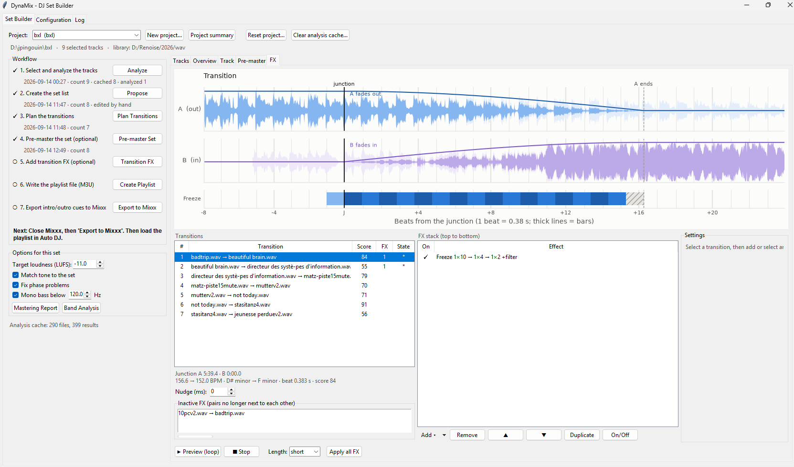

# DynaMix

**DynaMix** is dedicated to **building playlists with better transitions**. Its first use is the
**Auto DJ of [Mixxx](https://mixxx.org)**: DynaMix prepares the playlist and everything Auto DJ
needs to chain the tracks well, so that a whole set plays by itself and sounds mixed.

From your own tracks it lets you pick a selection from your music library, proposes playlists
that fit a duration and an energy curve, plans every transition on the beat (intro and outro
cues), levels badly mastered tracks, adds transition FX (freeze / roll, filter sweeps, echo, FX
samples) and exports the playlist with its cues into Mixxx.

> Because the project is built for Mixxx first, it may later be renamed (for example
> *DynaMixxx*); the name DynaMix is kept for now.



## About this fork

DynaMix started as a fork of [makalin/dynamix](https://github.com/makalin/dynamix) by
Mehmet T. Akalın (MIT License), a two-track energy analysis tool with BPM / key detection,
DJ notes and playlist helpers.

This repository has since **parted ways with the original project**. It went far beyond fixes:
the work is organised around set projects with a guided workflow, and most of the code is new
(music library and selection, set proposals, transition planning and Mixxx export, mastering
check and pre-master pass, band analysis, transition FX with a preview and a transition chart,
analysis cache, reports and log, a rebuilt GUI, a test suite). It follows its own direction,
does not track the upstream repository and is not meant to be merged back. The tools of the
original project that the set workflow does not use (two-track analysis, DJ notes, audio effects
analysis, Rekordbox / Traktor export) have been removed; only the track analysis it relies on
(`audio_utils.py`, `playlist_manager.py`) remains.

## Installation

> **Windows:** step-by-step guide in French in [INSTALL_WINDOWS.md](INSTALL_WINDOWS.md), or run
> `install_windows.bat`, then double-click `run_gui.bat`.

```bash
git clone https://github.com/timox/dynamix.git
cd dynamix
python -m venv venv
source venv/bin/activate          # Windows: venv\Scripts\activate
pip install -r requirements.txt
python check_install.py           # checks Python, packages, Tkinter, MP3 decoding
```

Python 3.11 or 3.12 is recommended (`numba`, used by librosa, lags behind new Python releases).
Tkinter is needed for the GUI. No FFmpeg is needed for MP3, WAV, FLAC and OGG (decoded by
soundfile / libsndfile); FFmpeg is only needed for M4A / AAC.

## Quick start

```bash
python gui.py
```

1. **Configuration** tab: set the projects folder, your **music library folder** (one folder with
   every track you mixed), the **FX samples folder** and the Mixxx database (auto-detected). The
   interface is available in **English and French** (Language: Auto follows Windows); French texts
   can be corrected in `<DynaMix home>/locales/fr.json`.
2. **Set Builder** tab: **New project...**, then follow the workflow panel:
   1. **Select and analyze**: add tracks from the library to the selection (BPM, key, energy;
      each file is analysed once and cached).
   2. **Propose**: several set lists from the selection for the chosen duration and energy curve;
      use one, then adjust it with Up / Down / Remove.
   3. **Plan Transitions**: beat-aligned intro and outro sections for every track.
   4. **Pre-master Set** (optional): corrected copies with consistent loudness and tone.
   5. **Transition FX** (optional): effects per transition, previewed in a loop, drawn on a chart.
   6. **Create Playlist** (optional): an M3U of the set.
   7. **Export to Mixxx**: intro / outro cues and the playlist, ready for Auto DJ.
3. **Log** tab: the reports of the project (summary, mastering, band analysis, transition sheet,
   pre-master, Mixxx export) and every message and error.
4. **Tasks** tab and status bar: the operations running in the background with their progress,
   and **Stop** (a stopped task leaves the project unchanged).

Redoing an early step resets the later ones, so the workflow status is always true. The GUI is
described tab by tab in [GUI_README.md](GUI_README.md).

## Set projects

A set is a **project folder** under the projects folder (default `~/DynaMix Projects`):

```
<projects folder>/<set name>/
    project.json     options, selection, analysed tracks, proposals, set list, step status, FX settings
    premaster/       corrected copies written by the pre-master pass
    fx/              copies with the transition FX
    exports/         M3U playlists, transitions.json, charts
    exports/reports/ reports, one text file each
    snapshots/       saved states of the settings (Snapshots... button), restorable
```

The music library is scanned in place and never written to (`library.py`); the originals and
the pre-mastered copies are never modified. Playback files are chosen in this order: FX copy,
pre-mastered copy (unless **Use pre-mastered copies** is unchecked), original; the workflow panel
always says which ones the set uses. **Snapshots...** saves the project's settings under a name
and restores them later (the audio copies are not part of a snapshot: steps whose copies changed
since are marked to redo). **Reset project...** starts a set again from an empty selection
(name, options and the analysis cache are kept); **Clear analysis cache...** forces the selected
tracks to be analysed again. Projects created by older versions keep working: their imported
`source/` copies become their selection.

- **Analysis cache** (`analysis_store.py`): `%LOCALAPPDATA%\DynaMix\analysis.sqlite` on Windows,
  `~/.dynamix/analysis.sqlite` elsewhere (`DYNAMIX_HOME` overrides).
- **Configuration** (`config.py`): `config.json` next to the cache.
- **Log** (`app_log.py`): `<DynaMix home>/logs/dynamix.log`.

## Energy level and set proposals

Each track gets an **energy level from 1 to 10**, computed on the loudness-normalised body of the
track (a quiet and a loud master of the same tune get the same level) from the tempo, the
percussive events per second, the share of percussive energy, the low end and the brightness;
the tempo and rhythm terms count fully when the track has a steady beat (a regular beat grid over
the whole track, so soft percussion, long intros or breaks do not make it "beatless"), and are
weighted by the share of percussion otherwise.

Set lists (`set_proposer.py`) come from a beam search over the selected tracks: they fit the
requested duration (crossfade overlaps deducted), follow the chosen curve in time (`build`,
`wave`, `peak_middle`, `constant`, or `all` to get one variant per curve) and keep neighbours
within a few BPM and harmonically compatible (Camelot wheel). The best distinct variants are
shown with their score and weakest transition.

## Transition planning and Mixxx Auto DJ

For each track DynaMix computes a beat-aligned **intro** section (where it starts under the
previous track, until its energy kicks in) and an **outro** section (where the previous track
starts fading, until it must be gone) (`transition_planner.py`). The transition sheet includes a
track-by-track synthesis with the mastering and band measurements.

**Export to Mixxx** (`mixxx_export.py`) writes them as Mixxx intro / outro cues and creates a
playlist in the set order. In Mixxx, add that playlist to the Auto DJ queue and pick the
**Full Intro + Outro** transition mode. The tracks must be in the Mixxx library (for a project
that uses copies, its `fx/` and `premaster/` folders too) and Mixxx must be closed during the
export; `mixxxdb.sqlite` is backed up first.

## Transition FX

Per transition, a stack of effects placed in beats around the junction (`transition_fx.py`,
`fx_render.py`, FX tab in `fx_window.py`):

- **Freeze / roll**: loops the last beats of the outgoing track (for example 4×1 → 2×2 → 1×4),
  with an optional loop filter and echo, a fade and a tail; the incoming track enters on the
  capture point.
- **Filter**: high-pass, low-pass or band-pass sweep with resonance, closing the outgoing track or
  opening the incoming one.
- **Echo**: tempo-synced, with damping; its tail may run into the next track.
- **Sample**: an FX sample from the samples folder, fitted to the outgoing track's tempo from the
  BPM written in its file name (varispeed or time-stretch), repeated if needed, anchored to end
  at, start at or centre on the junction.

The **transition chart** shows A and B with their fades, one lane per effect and the rendered
result on a beat axis. **▶ Preview (loop)** re-renders the transition when a setting changes and
**Nudge (ms)** shifts the junction by ear. **Apply all FX** renders copies into `fx/` with the
new cue positions. Settings are kept per track pair, so reordering the set keeps them.

## Mastering check, pre-master pass and band analysis

`mastering.py` measures every track like a mastering engineer: loudness (LUFS, ITU BS.1770),
loudness range, true peak, clipping, DC offset, tone balance, stereo phase (L/R correlation, bass
phase, mono compatibility, comb filtering). Flags are relative to the set ("darker than the rest
of the set", "quieter than the rest of the set"). The **pre-master pass** writes corrected copies:
loudness normalised (default -14 LUFS), true-peak limited at -1 dBTP, DC removed, polarity / bass
phase repaired, optional mono bass and tone matching to the set's median balance. Comb filtering
is only reported: it cannot be repaired without the stems.

`band_analysis.py` tracks the signal per band over time with tempo-based time constants, maps the
200-500 Hz masking against its neighbours and finds persistent resonances between 100 and 800 Hz
with EQ cut suggestions. Each resonance is named by its nearest note (approximate, like the key
detection) and marked when that note belongs to the track's key: a peak on the tonic or the fifth
is often the key itself (bass line, drone) rather than a mix problem. When they fire, the verdict is **mix revision recommended**: a
pre-master pass levels a set but cannot un-mask a low-mid build-up.

## Command line

```bash
# Mastering check, pre-master copies, band analysis (folders, .m3u files or a project folder)
python mastering.py check /path/to/music --json report.json
python mastering.py fix "~/DynaMix Projects/Saturday"      # a project: its set list, into premaster/
python mastering.py fix my_set.m3u --out out_dir --lufs -12 --format flac --tone
python mastering.py bands /path/to/music

# Transition planning and Mixxx export
python mixxx_export.py --project "~/DynaMix Projects/Saturday"   # uses the FX / pre-mastered copies (--originals to skip)
python mixxx_export.py --playlist /path/to/music --set-duration 60
python mixxx_export.py --m3u my_set.m3u --sheet transitions.txt
python mixxx_export.py --m3u my_set.m3u --no-mixxx               # plan only; --dry-run to preview the export
```

## Project layout

```
gui.py                GUI entry point (Set Builder, Configuration, Log tabs)
set_builder.py        Set Builder and Configuration tabs
fx_window.py          FX tab: effect stack, preview, transition chart
log_tab.py, reports.py, app_log.py   Log tab, project reports, log capture
set_project.py        project folder and project.json
library.py            music library and FX samples scan
set_proposer.py       set list proposals
transition_planner.py intro / outro planning and transition sheet
mixxx_export.py       Mixxx cues and playlist
mastering.py, band_analysis.py       mastering check, pre-master pass, band analysis
transition_fx.py, fx_render.py       FX engine, rendering of copies and previews
charts.py             matplotlib charts
audio_utils.py, playlist_manager.py  track analysis (BPM, key, energy, sections), analysis of the selection
export_tools.py       M3U playlist
analysis_store.py, config.py         analysis cache and configuration
ui_fonts.py           font size of the GUI
check_install.py, install_windows.bat, run_gui.bat   installation helpers
selftest.py, packaging/  self-test (--self-test) and the shareable Windows build
docs/                 design specs and implementation plans
tests/                unit tests and the GUI smoke test
```

## Tests

```bash
python -m unittest discover -s tests     # unit tests
python tests/gui_smoke.py                # drives the GUI end to end (opens a window briefly)
python gui.py --self-test                # checks this installation: Tk, charts, audio, analysis, limiter, FX
```

## Sharing DynaMix (Windows build and installer)

`packaging\build_windows.bat` builds a version of DynaMix that runs without Python: PyInstaller
freezes the interpreter and only the libraries DynaMix uses into `dist\DynaMix`
(`packaging\dynamix.spec` lists what is left out), then the script runs the build's self-test and
writes two things people can be given:

- `dist\DynaMix-<version>-setup.exe` — the installer (`packaging\dynamix.iss`, Inno Setup). It
  installs **for the current user only**, into `%LOCALAPPDATA%\Programs\DynaMix`, so it never asks
  for administrator rights, adds Start Menu and (optionally) desktop shortcuts, and uninstalls from
  Settings > Apps. Building it needs Inno Setup (`winget install JRSoftware.InnoSetup`); without it
  the script skips this step and still writes the folder and the zip.
- `dist\DynaMix-<version>-windows-x64.zip` — the same build as a zip, for people who would rather
  not install anything: unzip it and run `DynaMix.exe`.

The version comes from `version.py`, the only place it is written.

- The executable is not signed: Windows SmartScreen shows "Windows protected your PC", then
  **More info → Run anyway**.
- The first analysis is slower: numba compiles its code once and keeps it in
  `%LOCALAPPDATA%\DynaMix\numba_cache`.
- `DynaMix.exe --self-test report.txt` checks a copy on another machine without touching its data.
- FFmpeg is not included: it is GPL and DynaMix is MIT. The Configuration tab has a **Download**
  button next to the FFmpeg path, which fetches it from its own authors into the DynaMix folder
  when the user asks for it. It is only needed for M4A / AAC files.

## License

MIT License, see [LICENSE](LICENSE). The original project is © 2025 Mehmet T. Akalın; the
changes of this fork are © 2026 timox.

Built with [librosa](https://librosa.org/), [NumPy](https://numpy.org/),
[SciPy](https://scipy.org/), [soundfile](https://github.com/bastibe/python-soundfile),
[Matplotlib](https://matplotlib.org/) and [pandas](https://pandas.pydata.org/).
